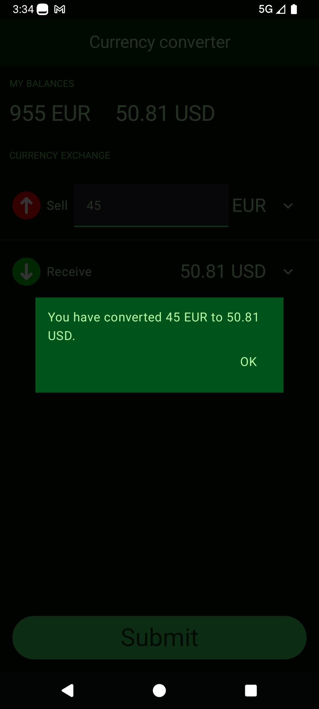

# 💱 Currency Converter

A modern, feature-rich Android application built with **Jetpack Compose** that allows users to convert between different currencies in real-time. Built with clean architecture principles and modern Android development practices.


## ✨ Features

### 🔄 **Real-time Currency Conversion**
- Live exchange rates updated every 5 seconds
- Support for multiple world currencies
- Instant conversion calculations
- Real-time balance updates

### 💰 **Smart Balance Management**
- Track balances across multiple currencies
- Automatic balance updates after conversions
- Insufficient balance validation
- Fee-free conversions (first 5 conversions)

### 🎯 **User Experience**
- Modern Material Design 3 interface
- Intuitive currency selection dialogs
- Real-time conversion previews
- Edge-to-edge display support

### 🌐 **Network & Data**
- RESTful API integration with Paysera
- Automatic retry mechanisms
- Offline state handling
- Real-time data synchronization

## 🏗️ Architecture

This app follows **Clean Architecture** principles with a modular structure:

```
📱 Presentation Layer (Jetpack Compose)
├── UI Components
├── ViewModels
└── State Management

🔧 Domain Layer (Business Logic)
├── Use Cases
├── Repositories (Interfaces)
└── Domain Models

📊 Data Layer (Data Management)
├── Repository Implementations
├── Data Mappers
└── Data Models

🌐 Network Layer (API Communication)
├── HTTP Client (Ktor)
├── API Endpoints
└── Response Handling

💾 Database Layer (Local Storage)
├── Room Database
├── DataStore
└── Local Caching
```

## 🛠️ Technology Stack

### **Core Technologies**
- **Kotlin** - Primary programming language
- **Jetpack Compose** - Modern UI toolkit
- **Material Design 3** - Design system
- **Koin** - Dependency injection

### **Architecture Components**
- **MVVM** - Architecture pattern
- **Repository Pattern** - Data access abstraction
- **Use Case Pattern** - Business logic encapsulation
- **StateFlow** - Reactive state management

### **Networking & Data**
- **Ktor** - HTTP client
- **Room** - Local database
- **DataStore** - Key-value storage
- **Kotlinx Serialization** - JSON parsing

### **Development Tools**
- **Gradle** - Build system
- **KSP** - Kotlin symbol processing
- **Compose Compiler** - Compose optimization
- **Custom Gradle Plugin** - Shared build logic across modules

## 📱 Screenshots

### **Main Screen**


*Main interface showing current balances and currency exchange setup*

### **Currency Exchange**

*Setting up a currency conversion with input amount and target currency*

### **Successful Conversion**


*Confirmation dialog after successful currency exchange*

### **Error Handling & User Feedback**


*Graceful error handling when network issues occur*


*User-friendly error message for insufficient funds*

## 🚀 Getting Started

### Prerequisites
- Android Studio Meerkat Feature Drop | Path 2024.3.2 Patch 1 or later
- Android SDK 24+ (API level 24)
- Kotlin 2.1.0
- JDK 17

### Installation

1. **Clone the repository**
   ```bash
   git clone https://github.com/arthurdanielyan/Currency-Converter.git
   cd CurrencyConverter
   ```

2. **Open in Android Studio**
   - Launch Android Studio
   - Open the project folder
   - Wait for Gradle sync to complete

3. **Build and Run**
   - Connect an Android device or start an emulator
   - Click the "Run" button

### Build Variants
- **Debug** - Development build with debugging enabled
- **Release** - Production build with optimizations

## 🔧 Configuration

### API Configuration
The app uses the Paysera API for currency exchange rates:
- **Base URL**: `https://developers.paysera.com`
- **Endpoint**: `/tasks/api/currency-exchange-rates`
- **Update Interval**: 5 seconds

### Local Configuration
- **Minimum SDK**: 24 (Android 7.0)
- **Target SDK**: 35 (Android 15)
- **Compile SDK**: 35

## 📊 Key Features Explained

### **Currency Exchange Logic**
```kotlin
// Fee-free conversions for first 5 transactions
private const val MIN_FEE_FREE_CONVERSIONS = 5
private const val FEE_PERCENTAGE = 0.07f

val fee = if(conversionCount > MIN_FEE_FREE_CONVERSIONS) {
    amount * FEE_PERCENTAGE
} else {
    0.0
}
```

### **Real-time Balance Updates**
- Automatic balance synchronization
- Transaction validation
- Insufficient balance handling
- Fee calculation and application

### **Network Resilience**
- Automatic retry mechanisms
- Offline state detection
- Error handling and user feedback
- Graceful degradation

## 📈 Performance Features

- **Lazy Loading** - Efficient list rendering
- **State Management** - Optimized UI updates
- **Background Processing** - Non-blocking operations
- **Memory Management** - Efficient resource usage

## 🔒 Security

- **Input Validation** - User input sanitization
- **Error Handling** - Secure error messages
